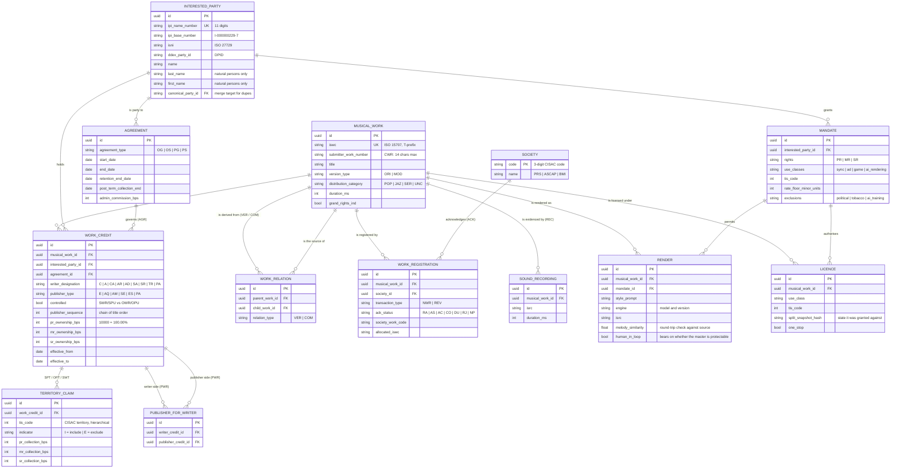

# INVOKE

> **This repository is the static landing page and the thinking behind it.**
> A single `index.html` plus `robots.txt`, this README — a working design document, not a spec — and [example.work](example.work), a complete worked example of the proposed format. Nothing here is the product.
>
> **The publishing administration platform is a work in progress being built at [github.com/malimccalla/invoke-works](https://github.com/malimccalla/invoke-works)** as a separate Python / FastAPI project.

INVOKE is an independent songwriting collective based in London, and the front end of a publishing administration platform for musical works.

---

## Thesis

**The recording is no longer the barrier. The song is everything.**

Recording and distribution are commodities. Anyone can cut a master and put it on every DSP on earth for the price of a coffee. What is *not* solved is the layer underneath: the musical work — who wrote it, who publishes it, who administers it, in which territory, for which right, at what share, and under which agreement.

That layer runs on spreadsheets, PDFs, email threads and a fixed-width flat file format designed in the 1990s. It is where money goes unmatched, where clearance takes six weeks, and where writers have the least visibility and the least leverage.

The asymmetry is concrete: **a sound recording has an artefact and a musical work does not.**

---

## The manifestation problem

### A work is not a thing

An image is a file. A film is a file. Software is a file. A sound recording is a file — you can hash it, stream it, fingerprint it, sign it, put it in an object store and point a URL at it.

A musical work is none of these. It is an abstract legal object: a melody-and-lyric that exists across every performance of it and is identical to none of them. You cannot download a musical work. You can only download evidence that one exists.

Library science has the vocabulary for exactly this. **FRBR** (IFLA's Functional Requirements for Bibliographic Records, now the LRM) splits creative output into four tiers — **Work → Expression → Manifestation → Item**. Beethoven's Ninth is a *work*; the 1996 London Philharmonic performance is an *expression*; the CD release of that performance is a *manifestation*; your copy is an *item*.

The music industry has excellent infrastructure at the manifestation and item tiers — ISRC, DDEX ERN, audio files, delivery pipelines. At the work tier it has an identifier and a batch message. **The work tier was never given an artefact.**

### Isn't CWR that artefact?

No, and the distinction is the whole design.

**CWR (Common Works Registration)** is a CISAC-governed fixed-width flat file for bulk registration and revision of works between publishers, PROs and mechanical societies. It is real, it is the only game in town, and INVOKE has to speak it fluently. But it is a **message**, not a **document**:

| CWR is | A manifestation would be |
| --- | --- |
| A batch transmission to a named recipient | Addressable and dereferenceable by anyone permitted |
| A point-in-time *claim* by a submitter | A versioned, verifiable state with history |
| Write-mostly, acknowledged asynchronously via `ACK` | Readable, with a stable identity |
| Lossy — it carries rights data, not the music | Anchored to the musical content itself |
| Register-only; it cannot express a licence | Composable into licensing and settlement |

CWR is the **EDIFACT of music publishing**, not the PDF. It is a wire format for one transaction type. The MLC's own guidance makes the point bluntly: CWR is for submitting hundreds or thousands of registrations at once, and "if you do not have thousands of work registrations, CWR may not be the best choice for you." It also cannot express a partial claim — a CWR registration necessarily covers *all* mechanical usage types. A format that cannot say "I control this for these uses and not those" is structurally incapable of supporting granular licensing.

And ISWC (ISO 15707) is only an identifier: `T-`, nine sequential digits, a mod-10 check digit. It encodes nothing — not the writers, not the shares, not the music. It is a pointer with no referent you can fetch. Duplicate ISWCs for the same work exist and, by CISAC's own admission, cannot be retired — only linked.

### Prior art

Partially, in three traditions that have never been joined up.

**Notation and content encodings** — MusicXML, MEI, MNX, LilyPond, ABC, Standard MIDI Files. These genuinely encode the *musical* content of a composition; MIDI is the closest thing to a machine-readable composition that exists at scale. None carry a byte of rights data.

**Rights and registration formats** — CWR, DDEX's works stack (**MWDR**: `MWL` for licensing, `MWN` for right-share notification, `LoD` for letters of direction; plus **BWARM** for bulk works-and-recordings metadata and **CDM** for claim detail and overclaim discrepancies), MLC bulk registration, ICE, CIS-Net. These carry rights data and no music.

**Legal deposit** — the oldest answer and the most instructive. US copyright registration historically required a deposit copy, usually a lead sheet. The courts have already had to rule on what the actual artefact of a musical work is, and in *Skidmore v. Led Zeppelin* (9th Cir. 2020, en banc) the answer was: for works registered under the 1909 Act, the scope of the copyright is the deposit copy, not the famous recording. The legal system's manifestation of a musical work is a piece of paper in an archive.

**Attempts to merge the three have a graveyard.** The International Music Joint Venture (1998–2001) dissolved without opening an office. WIPO's International Music Registry (2011) collapsed in industry infighting. The Global Repertoire Database (2008–2014) had thirteen CMOs, Google and Apple on board, and folded when committed investment was withdrawn. dotBlockchain Media tried to define a file format carrying rights alongside audio and became Verifi Media. The Open Music Initiative published a spec, then stopped. Mediachain and Ujo are gone. Blokur survives.

The pattern is unambiguous and worth stating plainly: **every attempt at a single global authoritative works database has failed, and they failed for governance reasons, not technical ones.** No rightsholder will cede the canonical copy. Any design that needs universal buy-in to be useful is dead before it starts.

### Reading the graveyard properly

**GRD (2008–2014)**

Convened in September 2008 by EU Competition Commissioner Neelie Kroes' Online Commerce Roundtable. It ran an RFI to more than eighty organisations, an RFP, and a Deloitte-managed scoping study involving 450+ individuals across six continents. The chosen technology was **ICE**, live since January 2010 and already running the distributions for PRS, MCPS and STIM, with **FastTrack** added later because societies were using it.

Setup was budgeted at **€23–32m**, annual operating cost at **€6.4–11.6m**, split between societies by size. The projected saving was **0.7–1% of annual global royalty revenue**. In July 2014 it was shelved with **$13.7m of debt** and nothing in production. ASCAP is reported to have been the first to stop funding it.

None of what went wrong was technical:

- **The savings accrued to the wrong balance sheet.** GRD's efficiency came from eliminating duplicated data processing, which is the societies' operating cost base and therefore part of what their commission is charged against. It asked intermediaries to fund their own disintermediation, for about 1% of revenue.
- **It was worth nothing until almost everyone joined.** Its FAQ conceded that participation could not be compelled — attempting to would likely have breached competition law — and that it would replace nothing, since every society and publisher would still keep its own database. The payoff was entirely network effect.
- **Six years and no artefact.** The R&D phase alone ran to May 2013, with four further phases planned over roughly three more years.

Its FAQ, in 2012, on whether it would use CWR:

> *"CWR doesn't accommodate registration of agreements information and also mandate information. This is one of the design issues that we need to address."*

`agreements` and `mandates` are in the `.work` schema for the reason the GRD working group gave first.

**IMJV (1998–2001)**

Buma/Stemra, PRS and ASCAP, later SOCAN. It reached 21% of world repertoire and dissolved without opening a single office. GEMA declined to join because the arrangement required it to make its own staff redundant to make room for Stemra's; smaller societies concluded they would be redundant if it launched.

So the blocker was headcount rather than schema. A design whose adoption implies that the person approving it loses their job does not get approved — which means the artefact has to be adoptable by one person, without a committee, and has to make existing back-office work cheaper rather than unnecessary.

**WIPO IMR (2011)**

Google offered to fund it. WIPO ended the partnership fearing it would hand Google too much influence, tried to fund it itself, and the project dissolved in label-versus-publisher infighting. Whoever pays for a registry is assumed to control it, which is why nobody can pay for one.

**Open Music Initiative (2016–~2020)**

The closest precedent to this project in intent. Its API specification — [omi/api-specs](https://github.com/omi/api-specs) — states the goal as *"Minimal Viable Interoperability"*, federated and distributed, "while not requiring ecosystem participants to give wholesale access to their data, or requiring registration in a centralized system," and reuses DDEX rather than reinventing it. That is design constraints 1, 2 and 3 below, written in 2017.

Two things in it are worth taking:

- **`Attestation` attaches to the mapping, not the entity.** OMI modelled `RecordingAndWorks`, `WorkAndRecordings` and `WorkContributors` as first-class objects each carrying an `Attestation` — an `Attestor` id, `created`, `expires`, `territory` and a **`confidence` float from 0.0 to 1.0**. The nodes in a rights graph are rarely what's wrong; the edges are. An edge can be false while both endpoints are correct and verified, and there is nowhere else for that error to live. [example.work](example.work) carries `attestations[]` on `evidence` and `derivation`, taking `attestor`, `created` and `confidence` and dropping `expires` and `territory` as unused here.
- **An `ext` extension convention**, so an implementation can carry proprietary fields without forking the schema and without them being silently dropped in transit. Adopted as a reverse-DNS-namespaced top-level `ext` object.

`api-specs` is a single `apiary.apib` file with one commit author, no releases, no listed contributors, last touched in 2017. The other five repositories — gateways to MusicBrainz and Hyperledger Sawtooth, a federated-query proof of concept — were all last updated on 3 November 2017. The organisation spent 2019 drafting and ratifying bylaws, articles of organization, corporate purposes, a membership agreement and an intellectual property policy: six governance PDFs for a specification that had been dead for two years. The surviving artefact is RAIDAR, a student licensing app.

The spec's own defects are instructive too, since a 200-member consortium made most of the mistakes listed under [model corrections](#model-corrections): splits as a single `split: 1.0` **float** per party, undivided by right; `territory` as an ISO 3166 string with no inclusion/exclusion; no agreements; no time dimension; and, in the published specification, `iswc: US-TEY-09-00057` — an ISRC sitting in the ISWC field.

**dotBlockchain / `.bc` (2016–)**

The closest precedent to `.work` as a format. Benji Rogers' proposal was a new music file — `.bc` instead of `.mp3` — bundling audio together with "minimum viable data" so that the rights information could not be separated from the recording. Two choices killed it:

- **It wrapped the audio.** A container replacing MP3 is useless until players, encoders, DSPs and delivery pipelines support it, which puts universal buy-in back in as a precondition.
- **It was patented.** US application 20200034792, granted as US 11,593,761, assigned to Dot Blockchain Music, Inc. A patented format makes the first question a lawyer's question, and that is the cost that kills adoption. The company became Verifi Media, a vendor.

`.work` holds a **digest and locators** rather than the audio for the same reason. The split is usually justified by size — 10–100 KB of rights data against a 30–60 MB WAV — and it also means nothing in the audio pipeline has to change for a `.work` file to be useful to the person holding it.

### What this changes here

- The `.work` schema stays unpatented and unlicensed, with no membership, no implementation licence and no consortium. The cost of adopting it must never exceed "read the schema."
- Attestations sit on **relationships** — work↔recording and work↔parent-work — and not only on content components. They are an ordered array rather than a single object, so corroboration is a second attestation rather than a bespoke field. **`confidence` is present only when the attestor is a model.** Its absence means a party asserted the claim rather than measured it, which is not the same as measuring it at `1.0`.
- A namespaced `ext` object, so proprietary fields survive a round trip instead of being dropped.
- Two additional design constraints, below, from GRD and IMJV.

### The INVOKE work package

Not a global database. A **work package**: a signed, content-addressed, versioned artefact that one party can produce, hold and hand to another, and which is useful on its own from day one.

It carries four things — the **identity** of the work, the **musical content** that anchors it, the **rights graph** that makes it commercial, and the **provenance** that makes every assertion in it attributable.

The useful analogues are outside music. An **SBOM** (SPDX/CycloneDX) is a machine-readable bill of materials for an intangible composite. An **OCI image manifest** gives content-addressed identity to something assembled from layers. **C2PA content credentials** attach signed provenance to media. A **git commit** gives verifiable, replayable history of who changed what.

The design has a deliberate limit: **a musical work cannot be fully represented, because its legal boundary is deliberately undefined.** Substantial similarity is decided by a jury, not a schema. The artefact is not the work. It is a *verifiable, versioned, attributable claim about* the work, with the musical content attached so the claim is anchored to something rather than floating free. That is exactly what a deposit copy does, and exactly what CWR does not.

---

## The `.work` file

See [example.work](example.work) for a complete, valid one.

### A file format needs no central authority

A format is three things: an agreed byte layout, a filename convention, and software that reads it.

| Thing | What it actually is |
| --- | --- |
| `package.json` | JSON, a schema, and a filename everyone agreed on |
| Git LFS pointer | three lines of text — version, `oid sha256:…`, `size` |
| `.dvc` | tiny YAML holding an md5 and a path |
| `.torrent` | small dict of filenames, sizes and piece hashes |
| OCI image manifest | JSON listing `mediaType` + `digest` + `size` per layer |
| `.ipynb`, `.geojson`, `.webmanifest`, `.har` | JSON with a custom extension, because the extension carries meaning |
| `.docx`, `.epub`, `.jar` | a **zip** with a defined internal layout |

`.work` is a JSON document conforming to a published JSON Schema (`https://invoke.works/schema/work/v1`), with a filename convention. Nobody's permission is required. If it is ever worth registering `application/vnd.invoke.work+json` with IANA, that is a form submission in the vendor tree, not a standards battle.

Strict JSON, deliberately — no comments, no trailing commas, no YAML. The manifest has to be canonicalisable (RFC 8785) so that signatures are stable across re-serialisation, and anything that permits two byte representations of the same document breaks that.

**And it should not be called `.json`.** The extension is the type signal — it tells a human what they've been sent, tells an OS which application to open it with, tells a validator which schema to apply, and gives editors something to bind syntax and completion to. `.ipynb` is JSON. `.geojson` is JSON. `.webmanifest` is JSON. Naming a file by its serialisation instead of its meaning throws away the only information the filename could have carried.

Tooling doesn't recognise the extension out of the box, so it has to be told: [.gitattributes](.gitattributes) maps `*.work` to JSON for GitHub's Linguist, and [.vscode/settings.json](.vscode/settings.json) does the same for the editor. Two lines each, and the file highlights and diffs properly everywhere.

### Size is what drives the design

The rights data — every party, every split, every agreement, every territory — is **10 to 100 KB**. A reference WAV is **30 to 60 MB**. The audio is 99.9% of the package.

So the manifest doesn't contain the audio. It contains a **digest** and a list of **locators** — annotated here for clarity, though a real `.work` file carries no comments:

```jsonc
{
  "role": "reference_recording",
  "media_type": "audio/wav",
  "digest": "sha256:0ad3f81b…",       // authoritative
  "size": 48210944,
  "locators": [                        // advisory, tried in order, all verified against the digest
    "https://cdn.invoke.works/blobs/sha256/0ad3f81b",
    "s3://mali-mccalla-archive/salt-water/reference.wav",
    "ipfs://bafybeigdyrzt5sfp7udm…"
  ]
}
```

The digest is the truth; the location is a hint. INVOKE can host it, the writer can host it, a publisher can mirror it, and all three verify identically. **Design constraint 3 — the canonical copy stays with the rightsholder — falls out of the format for free.**

### `.work` and `.workpkg` are not the same thing

The distinction matters because it is easy to get the analogy backwards:

| | Contains | Size | Analogue |
| --- | --- | --- | --- |
| **`.work`** | manifest only — identity, rights, digests, locators, signatures | kilobytes | **`.torrent`**, OCI image manifest, Git LFS pointer |
| **`.workpkg`** | manifest **plus every referenced blob**, zipped | tens of megabytes | `docker save`, `.epub`, a Git bundle |

A `.torrent` is the *small pointer file*, not the payload — which makes it the analogue of **`.work`**, not `.workpkg`. `.workpkg` is the "download everything and put it in a box" artefact: a zip with a defined layout, for archival, offline handoff, or attaching to a deal.

### Why a file at all, rather than a database row

Because a file can be emailed, archived, attached to a contract as an exhibit, kept on a drive for thirty years, and **verified with no server and no company still being alive**. A database row is a claim made by one party's infrastructure. A signed file is portable evidence.

And because it diffs. A `.work` file in a git repository turns a change of splits into a reviewable pull request — chain of title as version control.

### What the example demonstrates

[example.work](example.work) is a deliberately awkward song, because the easy cases prove nothing. It is `version: 3` of a work with a `parent` digest, and it exercises every correction listed further down this document:

- **Two writers, only one controlled.** Mali McCalla is `SWR`; June Okonkwo is `OWR` with her own publisher. Ownership totals exactly `10000` bps for PR, MR and SR independently.
- **A real `publisher_for_writer` chain**, so each writer's share has somewhere to flow.
- **A German sub-publisher with zero ownership and full collection** in that territory — expressed as `World / include` minus `Germany / exclude` on the original publisher, and `Germany / include` on the sub-publisher. This is the include/exclude TIS machinery doing the job an ISO country array cannot.
- **Every credit is time-bounded**, and agreements carry `retention_end_date` and `post_term_collection_end_date` separately from `end_date`.
- **A cleared interpolation** of another work, with the clearance document referenced by digest and its consideration modelled as a `royalty_participation` carrying `affects_ownership: false` — so the obligation is visible without corrupting the split.
- **The interpolation claim itself is attested twice** — a cover-identification model at `0.81`, then the writer confirming it by ear two days later. A machine accusing a song of derivation is a claim with money attached, and `0.81` is not a basis for a clearance on its own.
- **Structured names and a merge target.** Natural persons carry `last_name` / `first_name` and no concatenated display string; every party carries a nullable `canonical_party_id`, plus ISNI and DDEX Party ID alongside the IPI numbers.
- **A split registration outcome** — PRS accepted (`AS`), the MLC returned a conflict (`CO`) with an overclaim message. Both are data, neither is an error.
- **`clearability` computed to 5000 bps and `one_stop: false`**, naming the two specific parties blocking an instant sync grant.
- **A gospel render** in `renders[]` with its own ISRC, citing the `mandate_id` that permitted it, a `melody_similarity` of `0.94` against the source melody, an explicit note that the master's own copyright is thin, and `consent_coverage_bps: 2500` marking it internal-pitch-only — only one of the two writers has granted an `ai_rendering` mandate, and a UK joint work needs all of them.
- **A provenance trail showing a Whisper transcription at confidence `0.72` being corrected by a human**, then the rights being attested. Derived, then contested, then signed.

---

## Projections

A `.work` file is not a delivery format. It is the source that delivery formats are generated from. Each output is a **projection** — a lossy view of the document, shaped for one recipient:

| Projection | Recipient | Purpose |
| --- | --- | --- |
| **CWR** `NWR` / `REV` | PROs, mechanical societies | registration |
| **DDEX MWN** | societies, DSPs, licensees | musical work right share notification |
| **DDEX MWL** | licensees | licence request and grant |
| **DDEX LoD** | payors | letter of direction — where the money is actually sent |
| **DDEX BWARM** | bulk recipients | whole-catalogue works, recordings and right shares |
| **DDEX CDM** | DSPs | claim detail, and Part 5 responses to overclaim discrepancies |
| **Lead sheet** | US Copyright Office | statutory deposit copy |
| **Licence instrument** | a counterparty | a grant, with the split state it was made against |
| **Royalty statement** | payees | settlement against a versioned split |
| **Rendering** | anyone | a new recording of the work (below) |

### CWR

The registration case is the one that has to work, so this is a concrete projection. [example.work](example.work) projects to roughly this. Field order is illustrative — the real thing is fixed-width with exact column offsets from the CISAC spec.

```
HDR  00  555000111  INVOKE PUBLISHING LTD            01.10  20260504 090000  20260504
GRH  NWR  00001  02.10
  NWR  work#=INV00000000123  SALT WATER  T0345246801  EN  000333
       MOD  POP  recorded=Y  MTX  arr=ORI  lyr=ORI  grand_rights=N
    SPU  seq=01  00555000111  INVOKE PUBLISHING LTD   type=E
         pr 044/02500   mr 052/02500   sr 000/02500
      SPT  ip#=00555000111  tis=2136  I  02500 02500 02500
      SPT  ip#=00555000111  tis=0276  E  00000 00000 00000
    SPU  seq=02  00777888999  EDITION NORDLICHT GMBH  type=SE
         pr 035/00000   mr 035/00000   sr 035/00000
      SPT  ip#=00777888999  tis=0276  I  02500 02500 02500
    SWR  00123456789  MCCALLA / MALI  designation=CA
         pr 044/02500   mr 052/02500   sr 000/02500
      SWT  ip#=00123456789  tis=2136  I  02500 02500 02500
      PWR  00555000111  INVOKE PUBLISHING LTD  agreement=agr-001  writer=00123456789
    OPU  seq=01  00444333222  WEST PIER SONGS INC  type=E   pr 010/02500 …
    OWR  00987654321  OKONKWO / JUNE  designation=CA        pr 010/02500 …
    ALT  SALTWATER      type=AT
    ALT  AGUA SALADA    type=TT  ES
    VER  HARBOUR LIGHTS  T0104021171
    REC  GBAAA2600137  000333
GRT  00001  transactions=1  records=…
TRL  groups=1  transactions=1  records=…
```

**The basis points pay off exactly here.** CWR share fields are five digits with two implied decimals, `00000` to `10000`. `ownership_bps: 2500` becomes `02500` — no scaling, no conversion, no rounding. The choice was made for float-safety and turns out to be the native wire encoding.

Note the German sub-publishing deal surviving the projection intact: `World / include`, then `Germany / exclude` on the original publisher, then `Germany / include` on the sub-publisher. Three `SPT` records expressing something an ISO country array structurally cannot.

The remaining gaps are field-width and vocabulary detail. They fail at the society rather than at the schema:

- **`HDR` Sender ID is nine characters and an IPI Name Number is eleven.** CWR's rule is that a sender whose IPI exceeds nine digits puts the leading two digits in the **Sender Type** field and the remaining nine in **Sender ID** — so `00555000111` serialises as type `00`, id `555000111`, not as `PB` plus the whole number.
- **Submitter Work # is fourteen characters and a ULID is twenty-six.** `work_id` cannot be the submitter work number. `identity.submitter_work_number` carries a short, stable, submitter-scoped key alongside it, and the mapping between the two is the thing `ACK` reconciliation joins on.
- **Title Type `TE` is First Line of Text, not translation.** A translated title is `TT`.
- **`SPT` / `SWT` carry the Interested Party # and a sequence number**, and collection shares precede the inclusion/exclusion indicator and the TIS code in the record layout.
- `HDR` also needs sender credentials and a transmission date, which are account configuration rather than work data, and each society needs its own file with its own recipient code.
- Language maps ISO 639-2 → 639-1 (`eng` → `EN`), and duration truncates from milliseconds to `HHMMSS`.

### The projection is lossy in one direction only

Everything CWR needs is in the `.work` file. Much of the `.work` file has nowhere to go in CWR:

| In `.work` | Home in CWR |
| --- | --- |
| `clearances` — the interpolation licence and its terms | none |
| `mandates` — who has authorised what licensing | none |
| `clearability` — coverage in bps and the named gaps | none |
| `content` — melody, harmony, lyrics, score digests | none |
| `signatures`, `timestamps`, `provenance_log` | none |
| the version chain and per-component priority | none |

CWR can express *who owns what*. It cannot express *what the song is*, *who may license it*, *what it was derived from*, or *who asserted any of it and when*. So `.work` → CWR is a projection; CWR → `.work` recovers perhaps a third of the document.

### The interpolation trap

One case is worth spelling out, since the example file is built around it.

"Salt Water" is an original work containing a two-bar cleared interpolation of "Harbour Lights". CWR makes you choose between two wrong answers:

- **`version_type: ORI`** — the honest description, but then `music_arrangement`, `lyric_adaptation` and the `VER` record are all disallowed and the derivation disappears entirely.
- **`version_type: MOD`** with a `VER` record pointing at `T-010.402.117-1` — which keeps the link, but tells every society that Salt Water *is a version of* Harbour Lights. That is an open invitation for Harbour Lights' publisher to claim the whole work.

There is no third option, and the clearance itself has nowhere to go at all. Ten per cent of publisher receipts, worldwide, in perpetuity, is an obligation that does not touch ownership — the split still totals `10000` bps — and CWR only models ownership. So it lives in `clearances[].consideration` with `affects_ownership: false`, projects into the DDEX `MWL` grant, and projects into CWR not at all.

CWR cannot distinguish *derived from* from *is a version of*, and cannot record what the derivation cost.

That asymmetry is the entire argument for the format existing.

---

## Priority, versioning and deposit

Two requirements that look contradictory: *prove this existed on 1 March*, and *let me rewrite verse 2 in June*.

### Never mutate. Append.

```
work 01J8QK…                          ← stable identity, never changes
  ├── v1  sha256:aaa…  ts 2026-03-01   parent: —
  ├── v2  sha256:bbb…  ts 2026-04-12   parent: aaa    verse 2 lyrics rewritten
  └── v3  sha256:ccc…  ts 2026-06-30   parent: bbb    bridge added
```

The work is mutable. Its *states* are immutable and ordered. `v3` is current; `v1` still proves what existed in March.

**Per-component digests give per-element priority.** Because each piece of content is addressed separately, an unchanged component keeps a byte-identical digest across versions. If the lyrics changed between v1 and v3 but `melody` hashes the same throughout, that is cryptographic proof the melody dates to March — even though the song was edited twice since. Disputes are usually about the hook, so that is exactly the evidence worth having. **A single hash over the whole package would destroy this property.**

Components are addressed by `role`, which is unique within `content[]`. `content.melody` is therefore a stable reference that survives reordering; an array index would not be, which matters because provenance entries point at components by name.

It also resolves [model correction 6](#model-corrections) for nothing: "the split as at the usage date" is just whichever version was current on that date.

### How deposit actually works

**UK** — copyright is automatic on fixation (CDPA 1988 s.3(2)). There is **no UK copyright register at all**. The only thing that exists is evidence of date and authorship. "Poor man's copyright" — posting yourself a sealed envelope — is folklore; the IPO's own guidance is that it proves very little.

**US** — automatic too, but registration carries real consequences:

- It is a **prerequisite to filing an infringement suit** (*Fourth Estate v. Wall-Street.com*, 2019 — the granted registration, not merely the application)
- **Timely** registration unlocks **statutory damages and attorney's fees** (17 U.S.C. §412), which is the reason anyone actually does it
- §410(c) gives a prima facie presumption of validity
- The Office records an **effective date of registration** — so yes, it is timestamped by a government agency, and that timestamp has legal weight

### What a cryptographic timestamp does and does not do

It proves **a specific set of bytes existed at time T**. It does **not** prove authorship or originality. It is strong for rebutting "you took that from me," and useless for proving you didn't take it from someone else. Corroborating, never dispositive.

**This is also what settles the blockchain question.** Under **eIDAS Article 41**, a qualified electronic timestamp carries a legal *presumption* of date accuracy and data integrity. A blockchain anchor carries no such presumption in any jurisdiction. So an RFC 3161 timestamp is simultaneously cheaper, simpler and legally stronger than a chain — and a public append-only ledger full of writers' names and contact details is a GDPR erasure problem nobody wants to own.

Layered cheapest first:

| Mechanism | Cost | Strength |
| --- | --- | --- |
| Git commits, pushed to a remote | free | weak — `--date` is trivially forged, but the remote corroborates |
| **RFC 3161 qualified timestamp** | pennies | **eIDAS presumption of date and integrity — the recommendation** |
| Sigstore / Rekor transparency log | free | publicly auditable inclusion proof |
| OpenTimestamps → Bitcoin anchor | free | public anchor, no wallet or token, no legal presumption |
| US Copyright Office registration | ~$45 | the only one that unlocks statutory damages |

**"Qualified" is a term of art.** It means the timestamping authority appears on an EU member state's Trusted List. A free RFC 3161 service runs the identical protocol and is cryptographically just as sound, but carries no Article 41 presumption — which is why [example.work](example.work) records `qualified: false` against its timestamp.

### Automate deposit, don't replace it

Nothing cryptographic substitutes for §412. So the work package doesn't compete with legal deposit — it **emits** it. One artefact, four outputs:

- a **CWR** file for PROs and mechanical societies
- an **MLC** registration
- a **US Copyright Office** application with a generated lead-sheet deposit copy
- a **timestamped archival record** of the exact state at that moment

Which closes a loop with the section above. *Skidmore* held that the deposit copy defines the scope of protection. If the lead sheet is generated from an extracted melody, **the machine transcription becomes legally consequential** — a bad transcription literally narrows the rights it was meant to protect. Which is precisely why derived data may never be asserted as fact without a human attesting to it.

---

## Automated work packaging

A submission arrives as an audio file plus a filled-in form. How much of the package can be built without a human?

### Derivable from audio

| Layer | Approach |
| --- | --- |
| Recording identity | Chromaprint / AcoustID fingerprint; ACRCloud or Pex for commercial coverage |
| Work identity (covers, versions) | Cover-song identification — CREMA/Qmax alignment, ByteCover-class embeddings, Da-TACOS as benchmark |
| Stem isolation | Demucs — prerequisite for everything below |
| Melody → MIDI | `basic-pitch` for polyphonic transcription, CREPE for monophonic f0 on the isolated vocal |
| Harmony | madmom / Chordino chord estimation → harmonic reduction |
| Key, tempo, metre | librosa / Essentia |
| Lyrics + timing | Whisper large-v3 on the isolated vocal, WhisperX for forced alignment |
| Structure | segmentation into verse / chorus / bridge — useful for excerpt licensing |
| Sample detection | fingerprint against a reference corpus. Interpolations need the cover-ID path and remain genuinely hard |

### Not derivable, ever

Writer identities. IPI numbers. **Splits.** Publisher and admin chain. Territory deals. Whether a clearance actually exists. Whether the submitter had the authority to submit at all.

This is the honest line through the whole system, and it maps cleanly onto the FRBR framing above: **audio yields the content tier for free; the rights tier is irreducibly declared.**

### Draft until attested

```
submission ──▶ parse form ──▶ analyse audio ──▶ DRAFT package
                                                    │
                                          human review + correction
                                                    │
                                                    ▼
                                            ATTESTED package ──▶ sign ──▶ timestamp ──▶ register
```

Every derived field carries a confidence score and a provenance entry naming the model and version that produced it — `invoke:pipeline/basic-pitch@0.4.0`, confidence `0.87`, derived from a named blob digest. A package stays `draft` until a party with standing signs it. Nothing machine-generated is ever presented as a fact.

The `mailto:` form on the landing page is currently the de-facto intake schema. It is a stopgap: a real web form emitting JSON directly is the intended surface, because parsing prose into a rights graph is exactly where you don't want ambiguity.

---

## Rendering

The previous section goes audio → `.work`. This one goes the other way, and it is where the thesis stops being a slogan.

### The recording as a build artifact

A `.work` file carries `melody.mid`, a harmonic reduction, timed lyrics, structure, key and tempo. That is not an approximation of the input contract for music generation — **it is the input contract.** Singing voice synthesis (DiffSinger, NNSVS, Synthesizer V, ACE Studio) takes a MIDI melody plus phoneme-aligned lyrics. Melody-conditioned generation (MusicGen-melody, Stable Audio) takes a chromagram plus a text prompt. The file already holds both.

So a recording becomes a **render target**:

```
work 01J8QK… v3
   ├── render(style="gospel choir, live room, 72bpm")      ──▶  ISRC GBAAA2600214
   ├── render(style="uk drill, 140bpm, sparse")           ──▶  ISRC GBAAA2600215
   └── render(style="bossa nova, nylon guitar, intimate")  ──▶  ISRC GBAAA2600216

same work_id · same ISWC · same splits · three new masters
```

The work is source; the recording is a build. Compiling one source for three architectures.

This is also just FRBR, arriving on time. Each render is a new **Expression** of the same **Work** — the library scientists modelled this in 1998, long before it was mechanically possible.

**And it is only possible because `.work` has a content tier.** CWR cannot do this. A registration message describes ownership of a song it cannot itself represent. The melody and lyrics earn their place in the package twice: once as the legal deposit copy, once as generative input.

### Why this matters commercially

The honest near-term use is not replacing records. It's **pitching**.

A songwriter pitching to an artist needs the song heard in that artist's idiom, which today means paying for a demo per target. With a `.work` file you render one per pitch at the cost of inference. The catalogue becomes explorable in a way a folder of MP3 demos never is — *show me every work in the catalogue as a mid-tempo gospel ballad*.

Which is the thesis made literal. If any work can become any recording on demand, the recording was never the scarce thing.

### What it does to the rights graph

Nothing — and that's the point of separating work from recording in the first place.

A render produces a **new sound recording**: new master, new ISRC, new P-line. The **work is untouched**: same ISWC, same writers, same splits, same agreements. The rights graph does not fork. Only the recording tier multiplies.

Three caveats that belong in the design rather than the marketing:

**Authorship of the render is thin or absent.** The US Copyright Office's 2023 guidance and *Thaler v. Perlmutter* are clear that output without human authorship is not copyrightable. UK CDPA s.9(3) assigns computer-generated works to whoever made the arrangements for their creation, but that provision is contested and has been under review. Either way the *work* remains fully protected — only the new master may be weak. For a pitch demo, nobody cares. For a commercial release, a human needs to be meaningfully in the loop.

**A substantial arrangement is an arrangement.** If a person materially reworks the harmony or structure for the gospel version, that is an `AR` credit with a potential claim, and belongs in the rights graph as a credit on a derived work. If a model did it unaided, probably not. Model the relationship regardless — `WorkRelation` already exists for this.

**Consent is not assumed, it is a field.** [example.work](example.work) gates this in `mandates`, and the distinction matters: **`ai_training` and `ai_rendering` are different permissions.** Training a model *on* the work is not the same as synthesising a performance *of* the work. A writer may reasonably permit the second and refuse the first. Voice is separate again — rendering must not clone an identifiable artist's voice without consent, per the ELVIS Act (Tennessee, 2024) and the proposed NO FAKES Act.

### Round-tripping as a quality check

A melody extracted at `0.87` confidence and then re-rendered will drift. Usefully, the pipeline can check itself: extract the melody back out of the render and compare it to `content.melody`. Low similarity means either the render wandered off the song or the original transcription was wrong. Both are worth knowing before anything is deposited or registered.

---

## Scope

Deliberately narrow. Publishing only.

- Musical works, not masters
- Interested parties — writers, publishers, sub-publishers, administrators
- Splits and shares, separated by right and by territory
- Agreements and chain of title
- CWR generation, delivery and `ACK` reconciliation
- Rights clearance — samples, interpolations, derivatives, medleys
- Programmatic licensing against known mandates
- Royalty accounting and settlement
- Rendering works into recordings, gated by writer consent

Sound recordings appear only as *evidence of* a work or as a *render target* — never as the primary entity.

---

## Domain model

Modelled against CWR (v2.1 rev 8 / v2.2) so data can be delivered to societies without a translation layer bolted on at the end. Bracketed codes are the CWR record types each entity serialises to.



### `MusicalWork`

The composition. ISWC, titles and alternative titles, language, lyrics, duration, version type (`ORI` / `MOD`), distribution category, and clearance state.

### `InterestedParty`

A globally unique creative or corporate identity — a writer or a publisher entity. Keyed on **IPI Name Number** (11 digits) and **IPI Base Number** (`I-000000229-7`), with society affiliation held per right.

Deliberately *not* tenant-scoped. The same writer is the same entity everywhere; membership is a separate relation.

### `WorkCredit`

The junction, and the most important table in the system: an interested party assigned to a work with a role, a control indicator, and shares.

**Shares are split by right, never combined.** The single most common modelling error in publishing software. Each party holds independent ownership and collection shares in:

- **PR** — performing rights (broadcast, live, streaming)
- **MR** — mechanical rights (sales, downloads, reproduction)
- **SR** — synchronisation rights (film, TV, advertising, games)

Stored as **integer basis points**, `10000` = 100.00% — which is exactly how CWR encodes them, five digits with two implied decimals. Never floats.

**Control indicator** determines which CWR record type a credit serialises to:

| Record | Meaning |
| --- | --- |
| `SWR` | Writer controlled by submitter |
| `OWR` | Other writer, not controlled |
| `SPU` | Publisher controlled by submitter |
| `OPU` | Other publisher, not controlled |

---

## Model corrections

The earlier draft of this schema had real defects. They are listed here because finding them is the work.

**1 — Writer roles and publisher roles were merged into one enum.** They are two distinct CWR controlled vocabularies. Writer designation codes are `C`, `A`, `CA`, `AR`, `AD`, `SA`, `SR`, `TR`, `PA`. Publisher type codes are `E`, `AQ`, `AM`, `SE`, `ES`, `PA`. Collapsing them permits a composer-publisher, which is not a thing.

**2 — `ES` is not sub-publisher.** In CWR, `SE` is Sub Publisher and `ES` is *Substituted* Publisher. The original had this backwards. A sub-publishing chain built on `ES` will be rejected.

**3 — `PWR` was missing entirely.** CWR requires a Publisher For Writer record linking each controlled writer to the publisher their share flows through. Without it there is no chain of title and files will not validate. A flat list of credits cannot represent publishing — the structure is a graph.

**4 — Territory was an ISO 3166 string array.** CWR uses **TIS** codes (CISAC's Territory Information System), which are hierarchical, and every territory claim carries an **inclusion/exclusion indicator**. "World except US and Canada" is `include 2136, exclude 840, exclude 124`. An array cannot express exclusion, and using one as part of a uniqueness constraint is a footgun.

**5 — Collection shares were on the wrong record.** In CWR, ownership share is global and sits on `SPU`/`SWR`; collection share is *per territory* and sits on `SPT`/`SWT`. Putting both on the credit makes territorial deals unrepresentable. Collection shares move down to `TerritoryClaim`.

**6 — Splits had no time dimension.** Rights revert, catalogues are sold, terms expire. Royalties must be computed against the split **as it stood when the usage occurred**, not as it stands today. Every credit needs `effective_from` / `effective_to`, plus retention and post-term collection periods. This is the expensive bug: it is silent, and it surfaces as a restatement.

**7 — There was no `Agreement` entity.** Deal terms were scattered across credits as loose columns. CWR has a whole `AGR` transaction: agreement type (`OG`/`OS`/`PG`/`PS`), start and end dates, retention end, prior royalty status, post-term collection end, sales/manufacture clause. The contract is a real object; credits should reference it, not duplicate it.

**8 — Derivation was a JSON blob.** `isDerivative` / `isMedley` booleans plus an untyped `originalWorks` field. CWR needs structured `VER` (version of an original work) and `COM` (medley component) records. Model it as a self-referencing `WorkRelation` with a typed relation. The booleans are derivable from the relations; the relations are not derivable from the booleans.

**9 — Registration status was a single field on the work.** Registration is per society, per submission, per transaction, each with its own `ACK` and message records. One work has many `WorkRegistration` rows carrying the society, the transaction sequence, the returned status (`RA`, `AS`, `AC`, `CO`, `DU`, `RJ`, `NP`…), any allocated ISWC and the society's own work code. Conflicts (`CO`) are the interesting state and need somewhere to live.

**10 — `iswc @unique` globally, on a tenant-scoped work.** The model correctly kept `InterestedParty` global, then applied a global constraint to a workspace-scoped `MusicalWork`. Two publishers can legitimately hold credits in the same work. This exposes the real distinction: there is **the work** (global, sparse, identity-only) and **our claim on the work** (tenant-scoped, opinionated, complete). Conflating them is the same mistake the GRD made at industry scale.

**11 — Money as `Float`.** `adminCommission Float?`, `totalWriterShare Float?`. Percentages that touch money are integer basis points or `Decimal`, never binary floating point.

**12 — Missing conditionally-mandatory CWR fields.** `grand_rights_ind` (required for UK societies), `music_arrangement` and `lyric_adaptation` (required when version type is `MOD`), `recorded_indicator`, `text_music_relationship`, `composite_type`, `excerpt_type`, `duration` (mandatory for `SER`). These do not degrade gracefully — the file rejects.

**13 — Society codes as free strings.** The three-digit CISAC society codes are a controlled vocabulary. Lookup table and foreign key, not `String?`.

**14 — No merge strategy for parties without an IPI.** A nullable unique IPI permits unlimited duplicates of unregistered writers. Needs a `canonical_party_id` and an explicit merge path — because most new writers do not have an IPI yet, and onboarding them is the actual product.

**15 — Writer names were a single string.** Found while mapping the model onto CWR, which has separate Last Name and First Name fields for natural persons. Storing `"McCalla, Mali"` and splitting on the comma breaks on mononyms, on suffixes, and on every name where the family name isn't positionally obvious — which is most of the world. Natural persons need structured `last_name` / `first_name`; legal entities keep a single name field.

---

## Programmatic licensing

The reason to build the artefact. Everything above is plumbing; this is what it unlocks.

### Why sync clearance still takes six weeks

Licensing a song needs two independent grants — the master and the composition. The master side is usually one phone call, because one label controls it. The composition side is not: a song with four writers routinely has four publishers, two administrators and a sub-publisher in the relevant territory, and nobody holds a complete, current picture of who controls what.

There is also a jurisdictional trap that makes this a data problem rather than a paperwork problem. In the **US**, any joint owner can grant a non-exclusive licence unilaterally, subject to a duty to account to the others. In the **UK** (CDPA 1988) and most of Europe, a joint work requires the consent of *all* owners. Whether you can grant instantly is therefore a function of the split table and the territory — which means it is computable, if the split table is trustworthy.

### Mandates, and the clearability calculation

Attach a **`Mandate`** to each interested party's credit: the rights they authorise INVOKE to grant, the territories, the use classes, a rate card or floor, and exclusions (no political, no gambling, no tobacco, no AI training). A mandate is a standing offer, expressed as data.

A licence request then becomes an evaluation, not a negotiation:

```
POST /licence-requests
  work_id, use_class, territory, term, media, exclusivity

→ clearability: {
    pr: { covered_bps: 10000, grantable: true },
    mr: { covered_bps: 10000, grantable: true },
    sr: { covered_bps:  8750, grantable: false,
          gaps: [{ party: "…", bps: 1250, reason: "no_mandate" }] },
    exclusions_triggered: [],
    one_stop: false,
    quote: { … }
  }
```

**100% mandated coverage in the requested right and territory, no exclusion triggered, a rate on file → bind the licence, take payment, emit the ledger entries.** Anything less → a quote plus an escalation naming the *specific* residual, which already beats "we'll get back to you."

That `one_stop` boolean is the product. Production music libraries have dominated commercial sync for decades on exactly one advantage: pre-cleared, one-stop rights. Not better songs — lower transaction cost. A works catalogue with complete mandates has the same property without giving up the copyright.

### Design notes

- **The licence is itself an artefact.** Signed, addressable, versioned, carrying the exact split state it was granted against. When a dispute arrives three years later, the licence carries its own evidence.
- **Most-favoured-nations clauses get modelled, not handled by email.** If one writer's rate is raised in a sync, MFN co-writers match automatically. It is a rule on the deal, and the most common source of after-the-fact adjustments.
- **AI training is a use class, not an edge case.** Enumerable and separately excludable per party, per territory, from the start.
- **Adopt the DDEX works stack rather than inventing messages.** `MWL` (Musical Work Licensing) and `MWN` (Musical Work Right Share Notification) are two of the three MWDR choreographies — the third, `LoD`, covers letters of direction, which is exactly the "who actually gets paid" instrument the agreement chain implies. `BWARM` covers the bulk case CWR is usually reached for, and `CDM` Part 5 is the standard way to answer an overclaim. All of it is better than anything worth designing from scratch.
- **Settlement runs against the split as at usage date.** See correction 6. Every payout references an immutable snapshot.

---

## Architecture

Python, **FastAPI**, PostgreSQL. Pydantic models as the domain boundary; share and chain-of-title invariants enforced in the domain layer, not in route handlers.

```
GET    /works/{id}
POST   /works
GET    /works/{id}/credits
GET    /works/{id}/package            # the signed work package
GET    /works/{id}/clearability
GET    /interested-parties/{id}
POST   /agreements
POST   /registrations                 # generate + deliver CWR
POST   /registrations/ack             # ingest ACK, reconcile, surface conflicts
POST   /licence-requests
GET    /licences/{id}
GET    /royalties/statements/{id}
GET    /payouts/{id}
```

**Works registry** — canonical store for works, parties, agreements and splits, with per-right totals and chain-of-title completeness enforced as domain invariants.

**Work package builder** — assembles, hashes and signs the artefact described above.

**CWR engine** — generate conformant `NWR`/`REV` transactions from the internal model; parse and reconcile `ACK` files; surface `CO` conflicts as first-class objects rather than log lines.

**Licensing engine** — mandate evaluation, clearability, quoting, licence issuance.

**Settlement** — usage ingestion (DDEX **DSR**), matching, split application per right and territory, claim detail and overclaim responses (DDEX **CDM** Parts 3 and 5), commission netting, auditable ledger, payouts.

---

## Design constraints

Learned from the graveyard above, and non-negotiable:

1. **Never require industry-wide adoption to be useful.** The artefact has to be valuable to one writer holding one song on day one.
2. **Speak the existing standards fluently — CWR 2.1/2.2, DDEX (`MWL`, `MWN`, `LoD`, `BWARM`, `CDM`, `DSR`, `ERN`, `RIN`), ISWC, ISRC, IPI, ISNI, DDEX Party ID, TIS.** Interoperate, don't replace. The replacements are the ones that died.
3. **The canonical copy stays with the rightsholder.** No central authority. Federate, verify, reconcile.
4. **Every assertion is attributable and reversible.** Provenance is append-only; conflicts are data, not errors.
5. **Derived data is never asserted as fact.** Machine-extracted melody, lyrics and structure carry a confidence and a named producer, and stay `draft` until a party with standing signs them.
6. **Whoever adopts it captures the value.** GRD's savings landed on someone else's balance sheet — it asked societies to fund the elimination of their own operating margin, for around 1% of industry revenue. If the benefit of producing a work package does not accrue to the party producing it, the party will not produce it.
7. **The cost of adoption is reading the schema.** No patent, no implementation licence, no membership, no consortium, no committee. dotBC was patented and OMI required an IP policy; both made the first question a lawyer's question. And per IMJV, it has to be adoptable by one person whose job it does not threaten.

---

## Status

Early. Public page live, data model in its second iteration, `.work` format drafted, API in progress at [invoke-works](https://github.com/malimccalla/invoke-works). This repository stays the landing page and the design notes.

Contact: `mali@invoke.works`

---
